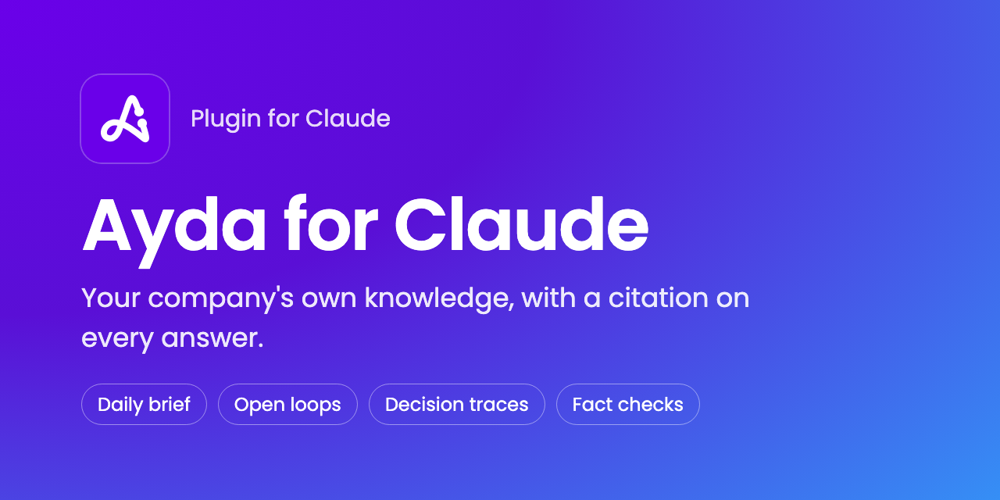
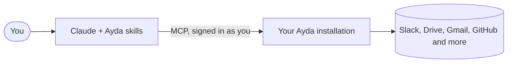

# Ayda for Claude

[](LICENSE)
[](CHANGELOG.md)
[](#skills)

[Ayda](https://aydahq.com) is company memory that your company owns and runs.
It reads the sources your company connects, such as Slack, Google Drive,
Gmail and GitHub, and answers with a citation for each statement.

This plugin connects Claude to your company's own Ayda installation. It also
adds skills that make Claude use Ayda well: fewer calls, a citation on each
statement, and the correct date for each fact.

## Skills

**Every day**

| Skill | What it does |
| --- | --- |
| `ayda-daily-brief` | Starts your day: what changed, what you owe, what others owe you, and what looks done. |
| `ayda-loop-sweep` | Goes through your open loops in small batches and records your verdict on each. |
| `ayda-remember` | Keeps the decisions and commitments from a conversation as your own Ayda memories. |

**When you need an answer you can trust**

| Skill | What it does |
| --- | --- |
| `ayda-decision-trace` | Shows how and why a decision was made, and how it changed, with citations. |
| `ayda-fact-check` | Checks a plan, document or change against recorded company facts. |
| `ayda-onboarding` | Writes a cited brief on a role, team or project, with a reading list. |
| `ayda-guide` | Holds the rules the other skills use: call cost, dates, conflicts between sources, and citations. |

Claude selects a skill when your request fits it. In Claude Code you can also
start one by name, for example `/ayda:ayda-daily-brief`. Name Ayda when you
want something kept there ("save this to Ayda"): in Claude Code a plain
"remember this" goes to Claude's own memory.

## In Claude Code

Claude Code does not show Ayda's panels, so the plugin draws its own there:

- **Open loops.** A row above the prompt shows how many loops are your move
  and how many wait on others. `/ayda-loops` opens the list with the
  record that raised each loop and a button for each verdict. A press goes directly to
  Ayda: no model reads or writes on the way.
- **Sources.** Each Ayda answer shows its sources as links, its temporal
  status, and a warning when two sources disagree or a quoted source changed.
- **Your day.** `today` uses your own time zone.

The plugin reads your open loops when a session starts and each 15 minutes
after that.

## Try it

- "Catch me up on what I missed yesterday."
- "Which of my open loops look done? Let's clear them."
- "Why did we change payment providers, and when did that happen?"
- "Check this proposal against what we agreed with the client."
- "Save to Ayda that we chose the Q4 pricing on the 12 October call."

## How it works



- Ayda runs in your company's own environment. The plugin connects to the
  host you give it and to nothing else.
- You sign in with your company account. Ayda answers as you and shows only
  the records you have access to.
- Each answer comes with its sources, so you can open the record behind each
  statement.

## Install

You need a company Ayda installation with **Agent access** switched on by an
admin, and its host name, for example `ayda.example.com`. If you do not know
the host name, ask your Ayda admin.

**Claude Code**

```text
/plugin marketplace add Ayda-Knowledge/ayda-plugin
/plugin install ayda@ayda
```

Enter your installation's host name when the plugin asks for it. Claude opens
a sign-in page the first time it calls Ayda.

**Claude apps (claude.ai, desktop and Cowork)**

1. In **Customize > Plugins**, select **Add > Add marketplace**, enter
   `Ayda-Knowledge/ayda-plugin`, and install **Ayda**.
2. Connect your installation:
   - If your organisation already has an Ayda connector, you are done. The
     skills use it, and the plugin's **Connectors** tab can still show
     **Not added**.
   - Otherwise, open the plugin's **Connectors** tab and select **Connect**.
     Replace the part in braces with your Ayda host, so the URL reads
     `https://<your Ayda host>/mcp`, then sign in.

**Other agents**

The skills are plain `SKILL.md` folders. Copy the folders under
[`plugin/skills/`](plugin/skills/) to your agent's skills directory, then connect your Ayda
MCP server in that agent. Ayda's **Connect Your Agent** page shows how for
each agent.

## Data and privacy

The plugin sends your questions to your company's own Ayda installation, at
the host you enter. It sends nothing to Ubundi or to any other service.

Ayda can change only two things, and only after you say so:

- `ayda-loop-sweep`, or a verdict button in the open loops pane, records
  your verdict (open, done or dismissed) on one of your own open loops.
- `ayda-remember` stores a sentence you approve as your own memory record.
  Ayda keeps the decisions it reads from that sentence pending until you
  confirm them in Ayda.

No skill writes to Slack, Google Drive, Gmail, GitHub or another source.

## Evals

The [`evals/`](evals/) suite checks the behaviour that matters: that the daily
brief reads your day in your own time zone, that a sweep writes nothing
before you decide, that instructions hidden in a record never cause a write,
and that two sources that disagree are both shown.

`scripts/eval-compare.sh` runs each case against a mocked Ayda, once with the
skills and once with the Ayda connection alone, so the difference is what the
skills add. The latest scores are in [evals/RESULTS.md](evals/RESULTS.md).

## Repository layout

- [`plugin/`](plugin/) is the plugin itself: the manifest, icon and skills.
  It is what Claude installs and what the Claude directory reads.
- Everything else, such as `scripts/`, CI and this README, supports its
  development and is not installed.

## Contributing

Ideas for new skills and fixes are welcome. Read
[CONTRIBUTING.md](CONTRIBUTING.md) first. To report a security problem, read
[SECURITY.md](SECURITY.md).

## Licence

[MIT](LICENSE) © 2026 Ubundi
